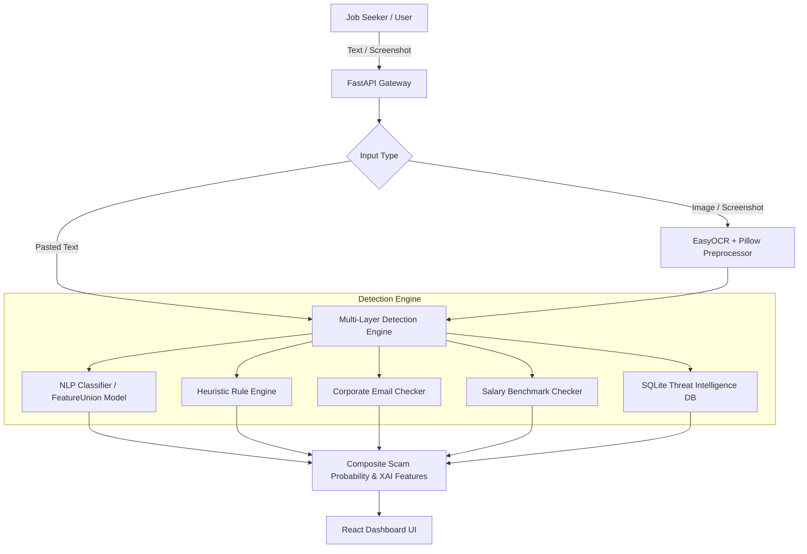

# JobShield AI 🛡️

[](https://fastapi.tiangolo.com)
[](https://react.dev)
[](https://vitejs.dev)
[](https://python.org)
[](https://scikit-learn.org)
[](https://opensource.org/licenses/MIT)

> **AI-Powered Fake Job & Internship Scam Detection Platform with Explainable AI (XAI), Domain-Aware Feature Engineering, and Crowdsourced Threat Intelligence.**

---

## 📌 Overview

Employment scams targeting students, fresh graduates, and career switchers are at an all-time high. Fraudsters exploit job seekers through advance-fee schemes ("registration / training fees", "refundable security deposits"), company impersonation, unrealistic salary promises, task-based investment scams, and unsolicited WhatsApp / Telegram recruitment.

**JobShield AI** is an intelligent defense platform that analyzes job offers, interview invites, and chat screenshots to evaluate scam risks in seconds. It combines **Machine Learning with Domain Feature Engineering (NLP)**, an **Extensive Heuristic Rule Engine**, **Optical Character Recognition (OCR)**, and a **Live Threat Intelligence Registry** to deliver accurate risk scores and actionable explanations.

---

## ✨ Key Features

### 1. 🔍 Multi-Modal Scam Scanner
- **Direct Text Analysis**: Paste job descriptions, emails, SMS alerts, or chat transcripts for instant screening.
- **Screenshot OCR Extraction**: Upload screenshots from WhatsApp, Telegram, LinkedIn, or email. Powered by **EasyOCR** with image preprocessing (upscaling, sharpening, and contrast tuning) to extract and process text.

### 2. 🧠 Multi-Layer Hybrid Detection Engine
- **Composite ML Pipeline (`FeatureUnion`)**: Combines high-capacity n-gram TF-IDF vectorization (1-2 ngrams, sublinear TF) with a custom **`ScamDomainFeatureExtractor`** that inspects:
  - 💸 **Advance Fee / Deposit Cues**: Registration fees, caution money, training kit charges, platform fees, and transfer triggers (`pay ₹...`).
  - 🪪 **KYC & Credential Harvesting**: Requests for Aadhaar, PAN card, bank account number, IFSC, OTP, and net-banking credentials.
  - ⏳ **High-Pressure Urgency**: "Limited seats", "offer expires today", "within 24 hours", "final call".
  - 📱 **Off-Platform Redirection**: Unofficial Telegram channels (`t.me`), WhatsApp numbers, Instagram DMs, and URL shorteners (`bit.ly`, `tinyurl`).
  - 🎯 **Unrealistic Guarantees & Task Scams**: "100% placement without interview", daily salary payouts, app rating / video liking task scams, crypto trading schemes.
  - 🛡️ **Legitimacy Dampeners**: Explicit protections such as "no registration fee", "equal opportunity employer", and standard provident fund/benefits notices.
- **Explainable AI (XAI)**: Reveals the exact keywords and domain feature contributions with directional weights (scam vs. legitimate) for every analysis.
- **Heuristic Rule Engine**: Multi-category regex inspection with negation handling (distinguishing *"no fee required"* from *"fee required"*).

### 3. ✨ Google AI Deep Search Grounding (Gemini)
- **Live Real-Time Web Research**: Optionally queries **Google Gemini 2.5 Flash** with **Google Search Grounding** to research company legitimacy, investigate recruiter phone numbers/emails, and verify employer registration on the web in real-time.
- **Web Source Citations**: Links directly to live Reddit, Glassdoor, Quora, and official corporate registry findings.
- **100% Graceful Fallback**: Operates autonomously with local ML & rules when no API key is provided.

### 4. 🏢 Web Intelligence & Brand Impersonation Detector
- **MNC Impersonation Check**: Instantly catches scammers claiming to represent Google, Amazon, TCS, Infosys, Deloitte, etc. while using personal WhatsApp numbers or free `@gmail.com` accounts.
- **Phishing Domain & TLD Inspector**: Flags high-risk scam TLDs (`.site`, `.xyz`, `.top`, `.online`) and masked URL shorteners (`bit.ly`, `tinyurl`).
- **1-Click Live Threat Search**: Interactive buttons to search company scam complaints, Truecaller numbers, and Cybercrime Portal (`cybercrime.gov.in`) with one click.

### 5. 🗄️ Crowdsourced Threat Intelligence
- **SQLite Registry**: Stores 2,000+ verified scam phone numbers, email addresses, UPI handles, phishing domains, and fake recruiters.
- **Instant Cross-Referencing**: Automatically matches incoming queries against known scam records.
- **Community Reporting**: Allows victims and seekers to report new scams and protect the community.

### 6. 🌓 Dark & Light Mode Theme Support
- **Full Theme Switching**: Seamless toggle between sleek Cyberpunk Dark Mode and clean Modern Light Mode with system auto-detection and persistent storage.

---

## 📊 Dataset & Model Performance

### 📁 Consolidated & Deduplicated Dataset
The model is trained on a **consolidated, strictly deduplicated dataset of 6,340 unique samples** (3,079 scam, 3,261 legit) with **2,357 unique template groups**:
- **Real-World Legitimate Postings**: 1,415 genuine corporate hiring emails and detailed LinkedIn job descriptions (Tesco, IBM, Amazon, Healthify, Meta).
- **Indian Job Scam Patterns**: 1,490 fake job offer scam communications with realistic INR registration fees (₹300–₹1,500), UPI transfers, and Aadhaar/OTP requests.
- **Diverse Scam Archetypes**: Placement consultancy fees, fake MNC impersonation, WFH task scams, overseas visa fraud, identity harvesting, and BPO bulk hiring.
- **100% Deduplicated**: Enforces strict text uniqueness (zero exact or whitespace-normalized duplicates) to prevent memorization.

### 📈 Honest Evaluation Benchmarks

| Benchmark / Evaluation Set | Test Samples | Accuracy | Precision | Recall | F1 Score | Evaluation Method |
| :--- | :---: | :---: | :---: | :---: | :---: | :--- |
| **Grouped Test Split** | 1,273 | **94.19%** | **92.46%** | **97.62%** | **0.9497** | Unseen template groups only |
| **5-Fold Group Cross Validation** | 6,340 | — | — | — | **0.9592 ± 0.0135** | `GroupKFold` across template IDs |
| **Real-World Holdout ([evaluate_real.py](backend/ml/evaluate_real.py))** | 27 | **92.59%** | **100.00%** | **84.62%** | **0.9167** | Hand-written real-world cases |
| **Blind Holdout ([evaluate_blind.py](backend/ml/evaluate_blind.py))** | 46 | **91.30%** | **92.31%** | **92.31%** | **0.9231** | Fresh, untuned edge cases |
| **End-to-End Production Pipeline ([evaluate_combined.py](backend/ml/evaluate_combined.py))** | 27 | **92.59%** | **100.00%** | **84.62%** | **0.9167** | Full ML + Rules + Database fusion |

---

## 🏗️ Architecture & Detection Flow



### Risk Classification System

| Scam Probability | Trust Level | Description |
| :--- | :--- | :--- |
| **0% – 19%** | 🟢 **Safe / Legitimate** | No scam patterns detected; standard professional communication. |
| **20% – 39%** | 🟡 **Low Risk** | Minor red flags or ambiguous phrasing; exercise normal caution. |
| **40% – 64%** | 🟠 **Moderate Risk** | Multiple warning signs detected; do not pay any upfront fees. |
| **65% – 84%** | 🔴 **High Risk** | Severe scam indicators found (e.g., fee requests, fake domains). |
| **85% – 100%** | 🚨 **Critical Scam** | Confirmed scam pattern or match with reported scam registry. |

---

## 📁 Repository Structure

```
JobShield-AI/
├── backend/
│   ├── main.py                     # FastAPI application entry point & CORS configuration
│   ├── requirements.txt            # Python dependencies
│   ├── database/
│   │   ├── db.py                   # SQLite database management (WAL mode)
│   │   └── scam_reports.db         # Scam reports database
│   ├── ml/
│   │   ├── consolidate_dataset.py  # Dataset merger & deduplication pipeline
│   │   ├── dataset_generator.py    # Synthetic dataset generator (uniqueness-enforced)
│   │   ├── train_model.py          # FeatureUnion + Logistic Regression training
│   │   ├── evaluate_real.py        # Real-world holdout evaluation script
│   │   ├── evaluate_blind.py       # Blind holdout evaluation script
│   │   ├── evaluate_combined.py    # End-to-end full pipeline evaluation script
│   │   ├── feature_extractor.py    # ML feature extractor adapter
│   │   ├── data/                   # Consolidated training data & source datasets
│   │   └── models/                 # Serialized production artifacts (Pipeline & Model)
│   ├── routers/
│   │   ├── analyze.py              # Endpoints for text & screenshot analysis
│   │   └── report.py               # Endpoints for scam reporting & threat lookups
│   └── services/
│       ├── feature_extractor.py    # ScamDomainFeatureExtractor (domain signals)
│       ├── nlp_analyzer.py         # NLP analyzer with XAI feature contributions
│       ├── rule_engine.py          # Heuristic pattern matching & negation scoring
│       ├── email_checker.py        # Email authenticity & domain verification
│       ├── salary_checker.py       # Salary benchmark & anomaly extraction
│       └── ocr_service.py          # EasyOCR pipeline with image preprocessing
│
└── frontend/
    ├── package.json                # Frontend dependencies & npm scripts
    ├── index.html                  # Main HTML template
    ├── vite.config.ts              # Vite build config
    └── src/
        ├── App.jsx                 # Main router & app layout
        ├── api/
        │   └── client.js           # Axios API client wrapper
        ├── pages/
        │   ├── HomePage.jsx        # Landing page with live statistics
        │   ├── AnalyzePage.jsx     # Interactive text & OCR scanner
        │   ├── ReportPage.jsx      # Scam database lookup & report submission
        │   └── AboutPage.jsx       # Educational scam guide & red flags
        └── components/
            ├── Navbar.jsx          # Global header navigation
            ├── Footer.jsx          # Global footer
            ├── FileUpload.jsx      # Drag-and-drop screenshot uploader
            ├── ResultCard.jsx      # Risk gauge & verdict summary
            ├── RiskFactorTable.jsx # Itemized risk breakdown
            └── HighlightedText.jsx # Visual text highlighter for scam phrases
```

---

## 🚀 Getting Started

### Prerequisites
- **Python 3.10+**
- **Node.js 18+** & **npm**
- **Git**

---

### 1. Clone the Repository
```bash
git clone https://github.com/UjwalL1605/JobShield-AI.git
cd JobShield-AI
```

---

### 2. Backend Setup
```bash
# Navigate to backend directory
cd backend

# Create and activate virtual environment
python -m venv venv
# On Windows:
venv\Scripts\activate
# On Linux/macOS:
source venv/bin/activate

# Install dependencies
pip install -r requirements.txt

# (Optional) Consolidate dataset & retrain ML model
python ml/consolidate_dataset.py
python ml/train_model.py

# (Optional) Run evaluation benchmarks
python ml/evaluate_real.py
python ml/evaluate_blind.py
python ml/evaluate_combined.py

# Start FastAPI server
python main.py
```
> 🌐 Backend runs on **`http://localhost:8000`**  
> 📖 Swagger API documentation is available at **`http://localhost:8000/docs`**

---

### 3. Frontend Setup
```bash
# Open a new terminal and navigate to frontend directory
cd frontend

# Install dependencies
npm install

# Start Vite development server
npm run dev
```
> 🌐 Frontend runs on **`http://localhost:5173`**

---

## 📡 API Reference

### Analysis Endpoints (`/api/analyze`)

| Method | Endpoint | Description | Payload |
| :--- | :--- | :--- | :--- |
| `POST` | `/api/analyze/text` | Analyze pasted text (email, job posting, chat) | `{"text": "...", "source_type": "job_posting"}` |
| `POST` | `/api/analyze/screenshot` | Upload screenshot for OCR extraction & analysis | `multipart/form-data` (file + `source_type`) |

### Report Endpoints (`/api/report`)

| Method | Endpoint | Description | Payload |
| :--- | :--- | :--- | :--- |
| `POST` | `/api/report/submit` | Submit a new scam report | `{"report_type": "...", "identifier": "...", ...}` |
| `POST` | `/api/report/check` | Check if an email / phone / UPI is a reported scam | `{"identifier": "..."}` |
| `GET` | `/api/report/recent` | Retrieve latest scam reports | Query param: `?limit=20` |
| `GET` | `/api/report/stats` | Retrieve threat registry aggregate statistics | *None* |

### Health Endpoint
| Method | Endpoint | Description |
| :--- | :--- | :--- |
| `GET` | `/api/health` | Service health status and ML model readiness |

---

## 🛡️ Best Practices & Job Safety Tips

1. **Never Pay for a Job**: Legitimate employers will never ask you to pay registration fees, application charges, or training deposits.
2. **Verify the Email Domain**: Official recruiters contact you from official corporate domains (`recruiter@company.com`), never generic free services (`recruiter.company@gmail.com`).
3. **Be Wary of Unsolicited Messaging**: Genuine interview processes do not happen exclusively via WhatsApp or Telegram without formal applications or video interviews.
4. **Too Good to Be True**: High salaries (e.g. ₹50k+/month) for simple copy-paste, data entry, or typing tasks are almost always fraudulent.

---

## 🤝 Contributing

Contributions are welcome! Please follow these steps:
1. Fork the Project (`https://github.com/UjwalL1605/JobShield-AI/fork`)
2. Create your Feature Branch (`git checkout -b feature/AmazingFeature`)
3. Commit your Changes (`git commit -m 'Add some AmazingFeature'`)
4. Push to the Branch (`git push origin feature/AmazingFeature`)
5. Open a Pull Request

---

## 📄 License

Distributed under the **MIT License**. See `LICENSE` for more information.
