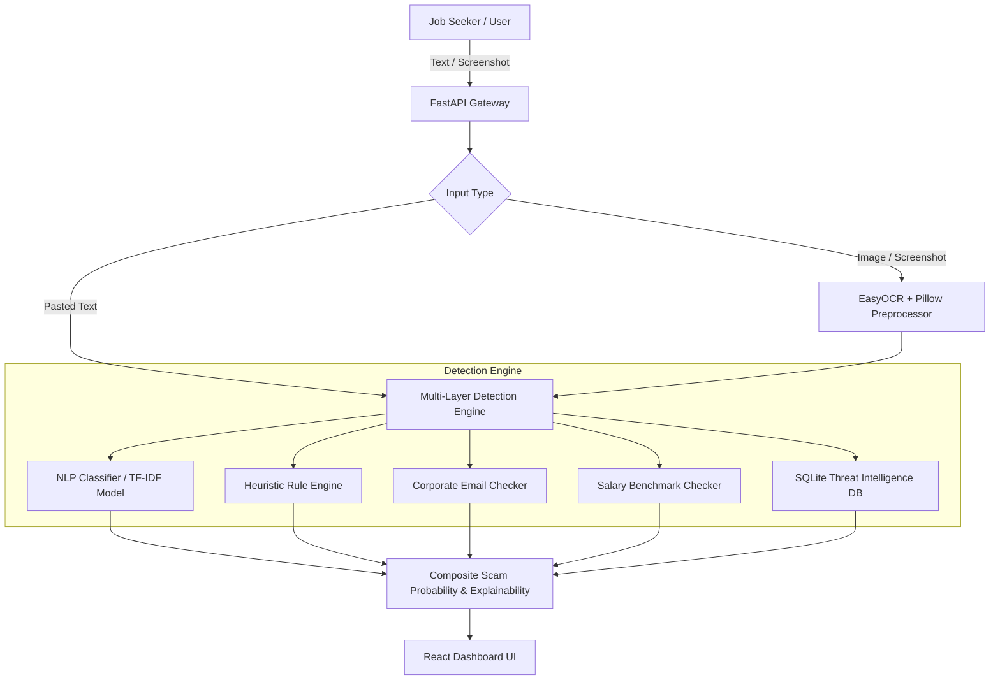

# JobShield AI 🛡️

[](https://fastapi.tiangolo.com)
[](https://react.dev)
[](https://vitejs.dev)
[](https://python.org)
[](https://scikit-learn.org)
[](https://opensource.org/licenses/MIT)

> **AI-Powered Fake Job & Internship Scam Detection Platform with Explainable AI (XAI) and Crowdsourced Threat Intelligence.**

---

## 📌 Overview

Employment scams targeting students, fresh graduates, and career switchers are at an all-time high. Fraudsters exploit job seekers through advance-fee schemes ("registration / training fees"), company impersonation, unrealistic compensation promises, and unsolicited WhatsApp / Telegram recruitment.

**JobShield AI** is an intelligent defense platform that analyzes job offers, interview invites, and chat screenshots to evaluate scam risks in seconds. It combines **Machine Learning (NLP)**, an **Extensive Heuristic Rule Engine**, **Optical Character Recognition (OCR)**, and a **Live Scam Registry** to deliver accurate risk scores and actionable explanations.

---

## ✨ Key Features

### 1. 🔍 Multi-Modal Scam Scanner
- **Direct Text Analysis**: Paste job descriptions, emails, SMS alerts, or chat transcripts for instant screening.
- **Screenshot OCR Extraction**: Upload screenshots from WhatsApp, Telegram, LinkedIn, or email. Powered by **EasyOCR** with image preprocessing (upscaling, sharpening, and contrast tuning) to extract and process text.

### 2. 🧠 Multi-Layer Hybrid Detection Engine
- **TF-IDF + Logistic Regression ML Model**: Trained on thousands of verified scam and legitimate recruitment communications.
- **Explainable AI (XAI)**: Reveals the exact keywords and directional feature weights contributing to the prediction.
- **Heuristic Rule Engine**: Inspects 8+ distinct scam categories:
  - 💸 **Advance Fee Requests**: "Registration fee", "laptop security deposit", "training charge", etc.
  - ⏳ **High-Pressure Urgency**: "Immediate joining in 2 hours", "limited seats", "expires today".
  - 🎯 **Unrealistic Guarantees**: "100% placement without interview", "no skills or resume needed".
  - 💳 **Direct Payment / UPI Demands**: `@paytm`, `@gpay`, `@phonepe`, UPI handles, and direct bank transfers.
  - 📱 **Suspicious Communication Channels**: Unofficial Telegram / WhatsApp / Instagram DM recruitment.
  - 🏢 **Brand Impersonation Signals**: Unverified claims representing Tier-1 tech or consulting firms.
  - 🎭 **Emotional Manipulation / Lottery Hooks**: "Congratulations! You won / You are shortlisted".

### 3. 🏢 Specialized Verification Modules
- **Corporate Email Authenticator**: Flags recruiters claiming to be from Fortune 500 or top IT companies while using free public domains (`@gmail.com`, `@yahoo.com`, `@outlook.com`).
- **Salary Anomaly Checker**: Evaluates stated compensation against realistic industry benchmarks for fresher, internship, data entry, and remote positions.

### 4. 🗄️ Crowdsourced Threat Intelligence
- **SQLite Registry**: Stores reported scam phone numbers, email addresses, UPI handles, phishing domains, and fake recruiters.
- **Instant Cross-Referencing**: Automatically matches incoming queries against known scam records.
- **Community Reporting**: Allows victims and seekers to report new scams and protect the community.

---

## 🏗️ Architecture & Detection Flow



### Risk Classification System

| Scam Probability | Trust Level | Description |
| :--- | :--- | :--- |
| **0% – 19%** | 🟢 **Safe / Legitimate** | No scam patterns detected; standard professional communication. |
| **20% – 39%** | 🟡 **Low Risk** | Minor red flags or ambiguous phrasing; exercise normal caution. |
| **40% – 64%** | 🟠 **Moderate Risk** | Multiple warning signs detected; do not pay any upfront fees. |
| **65% – 84%** | 🔴 **High Risk** | Severe scam indicators found (e.g., fee requests, fake domains). |
| **85% – 100%** | 🚨 **Critical Scam** | Confirmed scam pattern or match with reported scam registry. |

---

## 📁 Repository Structure

```
JobShield-AI/
├── backend/
│   ├── main.py                  # FastAPI application entry point & CORS configuration
│   ├── requirements.txt         # Python dependencies
│   ├── database/
│   │   ├── db.py                # SQLite database management (WAL mode)
│   │   └── scam_reports.db      # Scam reports database
│   ├── ml/
│   │   ├── dataset_generator.py # Synthetic dataset generation script
│   │   ├── train_model.py       # Model training & serialization pipeline
│   │   ├── data/                # Dataset storage (training_data.csv)
│   │   └── models/              # Serialized artifacts (TF-IDF & Classifier)
│   ├── routers/
│   │   ├── analyze.py           # Endpoints for text & screenshot analysis
│   │   └── report.py            # Endpoints for scam reporting & queries
│   └── services/
│       ├── rule_engine.py       # Heuristic pattern matching & scoring
│       ├── nlp_analyzer.py      # TF-IDF + Logistic Regression with XAI
│       ├── email_checker.py     # Email authenticity & impersonation detection
│       ├── salary_checker.py    # Salary benchmark & anomaly extraction
│       └── ocr_service.py       # EasyOCR pipeline with image preprocessing
│
└── frontend/
    ├── package.json             # Frontend dependencies & npm scripts
    ├── index.html               # Main HTML template
    ├── vite.config.ts           # Vite build config
    └── src/
        ├── App.jsx              # Main router & app layout
        ├── api/
        │   └── client.js        # Axios API client wrapper
        ├── pages/
        │   ├── HomePage.jsx     # Landing page with live statistics
        │   ├── AnalyzePage.jsx  # Interactive text & OCR scanner
        │   ├── ReportPage.jsx   # Scam database lookup & report submission
        │   └── AboutPage.jsx    # Educational scam guide & red flags
        └── components/
            ├── Navbar.jsx       # Global header navigation
            ├── Footer.jsx       # Global footer
            ├── FileUpload.jsx   # Drag-and-drop screenshot uploader
            ├── ResultCard.jsx   # Risk gauge & verdict summary
            ├── RiskFactorTable.jsx # Itemized risk breakdown
            └── HighlightedText.jsx # Visual text highlighter for scam phrases
```

---

## 🚀 Getting Started

### Prerequisites
- **Python 3.10+**
- **Node.js 18+** & **npm**
- **Git**

---

### 1. Clone the Repository
```bash
git clone https://github.com/UjwalL1605/JobShield-AI.git
cd JobShield-AI
```

---

### 2. Backend Setup
```bash
# Navigate to backend directory
cd backend

# Create and activate virtual environment (optional but recommended)
python -m venv venv
# On Windows:
venv\Scripts\activate
# On Linux/macOS:
source venv/bin/activate

# Install dependencies
pip install -r requirements.txt

# Train / build ML models (if not already trained)
python ml/train_model.py

# Start FastAPI server
python main.py
```
> 🌐 Backend runs on **`http://localhost:8000`**  
> 📖 Swagger API documentation is available at **`http://localhost:8000/docs`**

---

### 3. Frontend Setup
```bash
# Open a new terminal and navigate to frontend directory
cd frontend

# Install dependencies
npm install

# Start Vite development server
npm run dev
```
> 🌐 Frontend runs on **`http://localhost:5173`**

---

## 📡 API Reference

### Analysis Endpoints (`/api/analyze`)

| Method | Endpoint | Description | Payload |
| :--- | :--- | :--- | :--- |
| `POST` | `/api/analyze/text` | Analyze pasted text (email, job posting, chat) | `{"text": "...", "source_type": "job_posting"}` |
| `POST` | `/api/analyze/screenshot` | Upload screenshot for OCR extraction & analysis | `multipart/form-data` (file + `source_type`) |

### Report Endpoints (`/api/report`)

| Method | Endpoint | Description | Payload |
| :--- | :--- | :--- | :--- |
| `POST` | `/api/report/submit` | Submit a new scam report | `{"report_type": "...", "identifier": "...", ...}` |
| `POST` | `/api/report/check` | Check if an email / phone / UPI is a reported scam | `{"identifier": "..."}` |
| `GET` | `/api/report/recent` | Retrieve latest scam reports | Query param: `?limit=20` |
| `GET` | `/api/report/stats` | Retrieve threat registry aggregate statistics | *None* |

### Health Endpoint
| Method | Endpoint | Description |
| :--- | :--- | :--- |
| `GET` | `/api/health` | Service health status and ML model readiness |

---

## 🛡️ Best Practices & Job Safety Tips

1. **Never Pay for a Job**: Legitimate employers will never ask you to pay registration fees, application charges, or training deposits.
2. **Verify the Email Domain**: Official recruiters contact you from official corporate domains (`recruiter@company.com`), never generic free services (`recruiter.company@gmail.com`).
3. **Be Wary of Unsolicited Messaging**: Genuine interview processes do not happen exclusively via WhatsApp or Telegram without formal applications or video interviews.
4. **Too Good to Be True**: High salaries (e.g. ₹50k+/month) for simple copy-paste, data entry, or typing tasks are almost always fraudulent.

---

## 🤝 Contributing

Contributions are welcome! Please follow these steps:
1. Fork the Project (`https://github.com/UjwalL1605/JobShield-AI/fork`)
2. Create your Feature Branch (`git checkout -b feature/AmazingFeature`)
3. Commit your Changes (`git commit -m 'Add some AmazingFeature'`)
4. Push to the Branch (`git push origin feature/AmazingFeature`)
5. Open a Pull Request

---

## 📄 License

Distributed under the **MIT License**. See `LICENSE` for more information.
